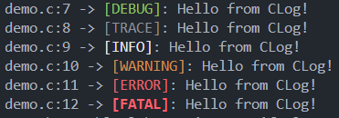

# CLog
CLog is a simple header-only logging library for C and C++.

# Usage
CLog uses a basic macro for logging, and an enum for the different levels of logging
```C
#include "clog.h"

int main(void) {
    clog(CLOG_DEBUG,   "Hello from CLog!\n");
    clog(CLOG_TRACE,   "Hello from CLog!\n");
    clog(CLOG_INFO,    "Hello from CLog!\n");
    clog(CLOG_WARNING, "Hello from CLog!\n");
    clog(CLOG_ERROR,   "Hello from CLog!\n");
    clog(CLOG_FATAL,   "Hello from CLog!\n");
}
```

The output of this would look something this:

